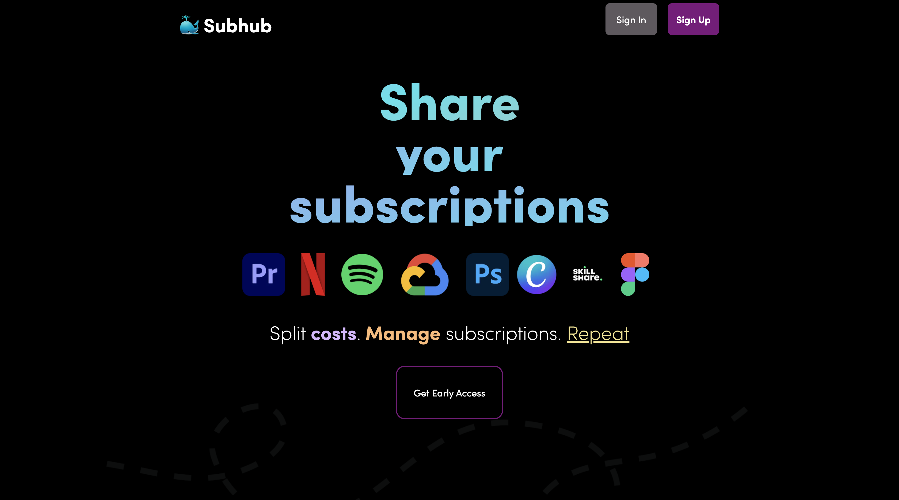

# Subhub



This is a starting point for a subscription I've been working on. I will be sharing updates here. All of this project was built with typescript, tailwind, firebase and next.js

## Live demo

https://subhub.app

## Running the project

First, run the downlaod the neccessary packages:

```bash
npm i
# or
yarn add

```

### Important

You will have to provide your own secrets file in order to get this to run with firebase and mixpanel.

Then, start the development server

```bash
npm run dev
# or
yarn dev
```
